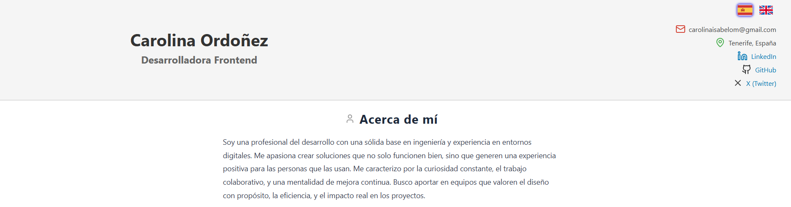

# 💻 CV Web – Carolina Ordoñez

Bienvenido/a a mi currículum web interactivo, desarrollado con React como parte de mi portafolio profesional. Este proyecto presenta de manera moderna y dinámica mi experiencia, habilidades y proyectos como desarrolladora frontend.

✨ La interfaz está diseñada para ofrecer una navegación intuitiva y una presentación clara de mi perfil técnico, combinando diseño con propósito y eficiencia.

## 
****

🔗 **Versión en línea:** [https://carolina-ordonez-sites.netlify.app/](https://carolina-ordonez-sites.netlify.app/)

---

## 🛠️ Tecnologías utilizadas

* React
* JavaScript
* HTML & CSS
* Netlify (para despliegue)

---

## 📁 Estructura del proyecto

Este repositorio incluye todos los archivos fuente del proyecto, configuraciones necesarias y documentación básica para su despliegue. Puedes explorar el código, clonar el repositorio y adaptarlo a tus propios proyectos.

---

## 🎮 Proyectos destacados

* **La Mirada De Tu Alma**
    Creación de la página web, que combina una estética mística y moderna con ilustraciones y un formulario de contacto, creado con la potencia de React, Vite y la flexibilidad de Tailwind CSS.
* **Snake Game**: Juego clásico de la serpiente, ideal para practicar lógica y manejo de estado.
* **Piedra, Papel o Tijera**: Juego interactivo contra el sistema, ¡perfecto para divertirse y aprender!
* **Princess Peach Showtime**
    Página web informativa sobre el videojuego de Nintendo *Princess Peach Showtime*. Creada con React, Vite y CSS, explora personajes, escenarios y la fecha de lanzamiento.
* **Buscador Disney**
    Buscador interactivo donde, al seleccionar una letra del abecedario, se descubren personajes de Disney que comiencen con esa letra. Muestra foto y breve descripción.
* **Asociacion Lejos De Casa**
    Creación de la página web para una organización sin fines de lucro, brindando apoyo a migrantes. Construida como una SPA utilizando React, Vite, TypeScript, y Tailwind CSS, con enfoque en la integración y la convivencia intercultural.
* **Repuestos Uruguay**
    Creación de la página web de la empresa utilizando HTML, CSS, JavaScript, Python y Bootstrap, mejorando la presencia digital y la interacción con clientes.
* **Taller Femauto**
    Realización de módulos y actualización de la web del taller utilizando HTML, CSS, Python y Bootstrap.

---

Gracias por visitar este proyecto. ¡Espero que te inspire tanto como a mí desarrollarlo!
